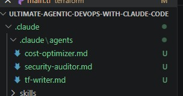
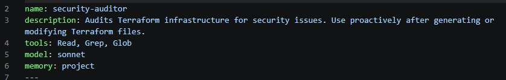
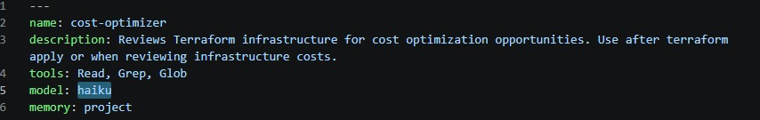
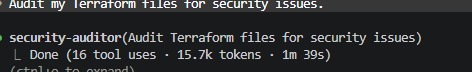
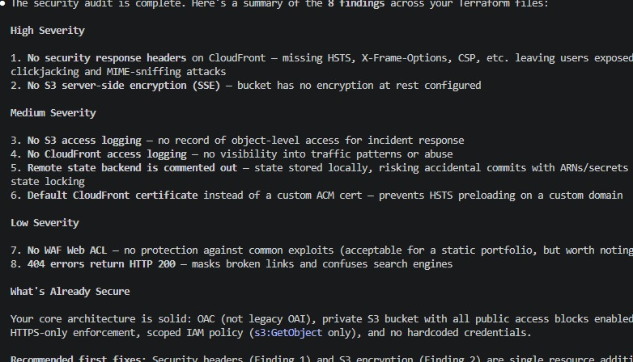
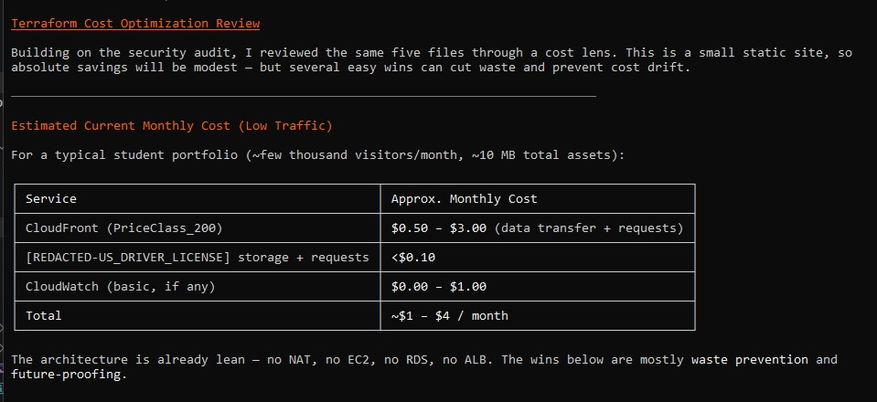

# Assignment 4 — Building Your AI Team

Part of the DevOps Micro Internship (DMI) Cohort 3 with Agentic AI

---

## Purpose

In this assignment, you will build and configure a set of specialized AI subagents inside your project. You will learn how different models and tool permissions define agent behavior, and you will trigger two real agent delegations to analyze security and cost aspects of your Terraform infrastructure.

---

# Task 1 — Create the Agents Folder and Add Files

## Goal

Create the `.claude/agents/` directory and add all required agent files.

### Evidence

#### Screenshot 1 — VS Code sidebar showing `.claude/agents/` with all 3 files

---

# Task 2 — Compare the Agent Configurations

## Goal

Analyze the configuration differences between the three agents and demonstrate understanding of model and tool selection.

### Written Answers

#### 1. Why does the cost optimizer use Haiku instead of Sonnet?

The cost-optimizer only has Read, Grep, Glob — read-only tools for scanning Terraform files and matching patterns (like oversized instance types or missing lifecycle rules). This is a lightweight, repeatable pattern-matching task, not deep architectural reasoning, so Haiku's speed and lower cost are a better fit than paying for Sonnet's heavier reasoning on a routine check.

---

#### 2. Why does the security auditor NOT have Write in its tools list?

The security-auditor's tools are Read, Grep, Glob, no Write or Edit. Its job is strictly to audit and report, not to modify infrastructure. Keeping it read-only enforces a safety boundary: it can flag HIGH-severity issues but can never make an unreviewed change to live infrastructure files itself. This mirrors how a real security auditor role works, analysis and reporting stay separate from remediation.

---

#### 3. Why does the tf-writer use `inherit` instead of a specific model?

tf-writer is the only one of the three with Write and Edit in its tools, it actually generates and modifies production Terraform code. Using model: inherit means it always runs on whatever model is powering the main session (rather than being pinned to Sonnet or Haiku), so if you're running a more capable model in your main session for a complex infra task, the writer benefits from that same capability rather than being capped.

---

### Evidence

#### Screenshot 2 — `security-auditor.md` frontmatter showing model and tools configuration

---

#### Screenshot 3 — `cost-optimizer.md` frontmatter showing the model and tools configuration

.

---

# Task 3 — Run the Security Auditor

## Goal

Trigger the security auditor agent and analyze the generated security report for your Terraform infrastructure.

### Evidence

#### Screenshot 4 — The delegation message showing Claude launched the security-auditor

.

---

#### Screenshot 5 — Security audit report output

.

---

# Task 4 — Run the Cost Optimizer

## Goal

Trigger the cost optimizer agent and review the generated cost optimization report.

### Evidence

#### Screenshot 6 — The full cost optimization report

.

---

# Submission Instructions

- Ensure all agent files are committed in `.claude/agents/`
- Complete all written answers in your GitHub Repo
- Push final changes to your forked GitHub repository

---

## GitHub Repository URL

Paste your forked repository URL here:

`https://github.com/Ritacloud23/Ultimate-Agentic-DevOps-with-Claude-Code.git__________________________`

---

# Completion Checklist

- [x ] `.claude/agents/` folder contains all 3 agent files
- [x ] Screenshot 2 shows correct `security-auditor.md` configuration
- [x ] Screenshot 3 shows correct `cost-optimizer.md` configuration
- [x ] All 3 written answers completed 
- [x ] Security auditor executed successfully
- [x ] Cost optimizer executed successfully
- [x ] Security report is visible with findings
- [x ] Cost report is visible with recommendations
- [x ] All required screenshots added
- [x ] GitHub repo updated with agents

---

## 📌 About DMI & CloudAdvisory

DevOps Micro Internship (DMI) is a project-based DevOps program run by Pravin Mishra (The CloudAdvisory) focused on real-world execution, systems thinking, and career readiness.

It helps learners build strong DevOps foundations with hands-on experience.

---

## 📌 Resources

- 🌐 DMI Official Website: https://pravinmishra.com/dmi  
- 🎓 DevOps for Beginners (Udemy): https://www.udemy.com/course/devops-for-beginners-docker-k8s-cloud-cicd-4-projects/  
- 🎓 Agentic AI DevOps with Claude Code: https://www.udemy.com/course/ultimate-agentic-ai-devops-with-claude-code/  
- 🎓 DevOps with Claude Code: Terraform, EKS, ArgoCD & Helm: https://www.udemy.com/course/devops-with-claude-code-terraform-eks-argocd-helm/  
- ▶️ YouTube Playlist: https://www.youtube.com/playlist?list=PLFeSNDtI4Cho  
- 🔗 Pravin Mishra (LinkedIn): https://www.linkedin.com/in/pravin-mishra-aws-trainer/  
- 🏢 CloudAdvisory (LinkedIn): https://www.linkedin.com/company/thecloudadvisory/

---

*This submission is part of DevOps Micro Internship (DMI) Cohort 3 — Agentic AI Track.*